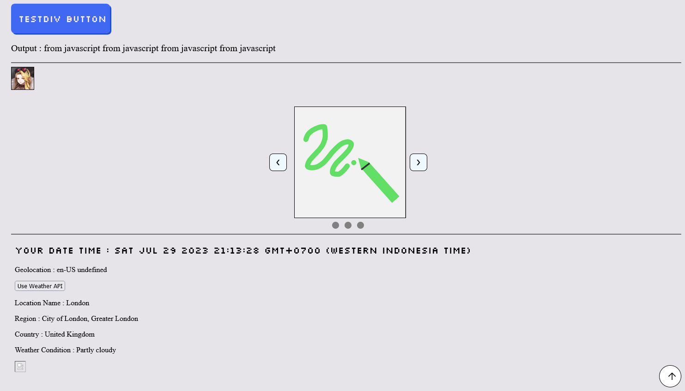

GitHub Repo : **Private**

  
**Description** : Nothing special here, just me experimenting with basic HTML, CSS, JavaScript.

---
What I used :
- HTML
- CSS
- JavaScript (Datetime API, Geolocation API)
- [Weather API](https://www.weatherapi.com/)
---
What I did/made/learned :
- Button Hover Transition
- Image Slideshow
- Local Datetime & Geolocation
- Simple GET Request
---
System Design : **None**
UI Design : **None**